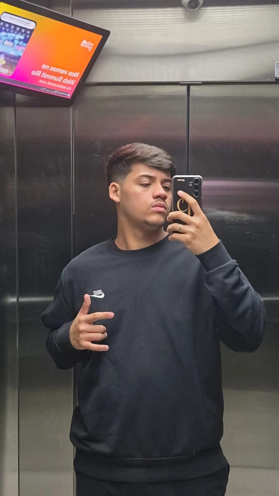
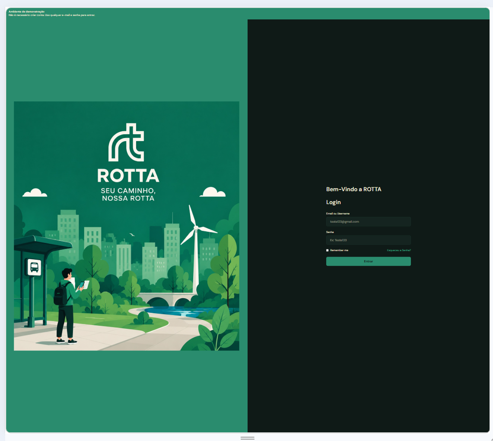
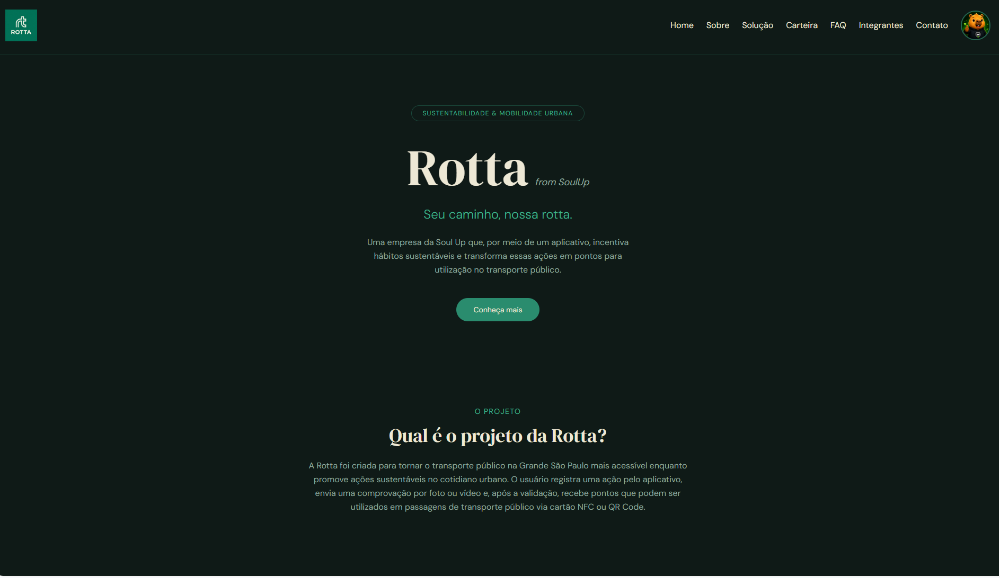
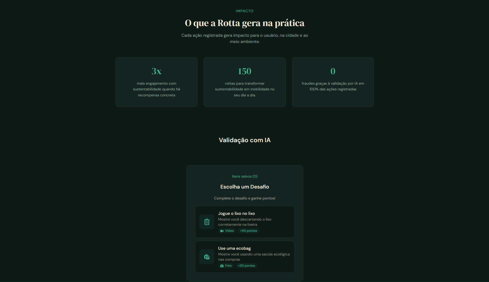
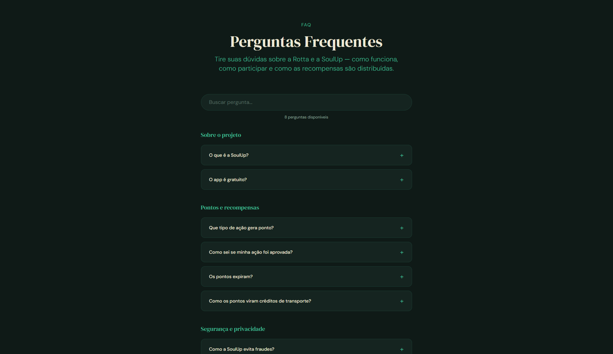
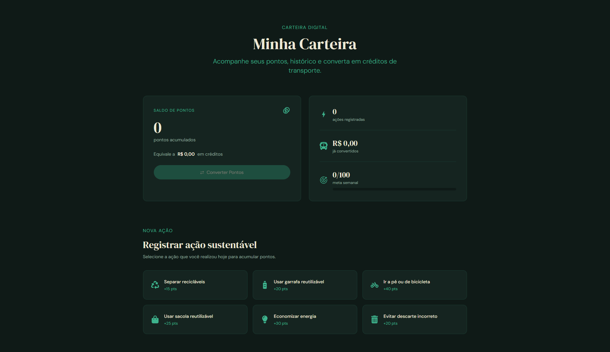
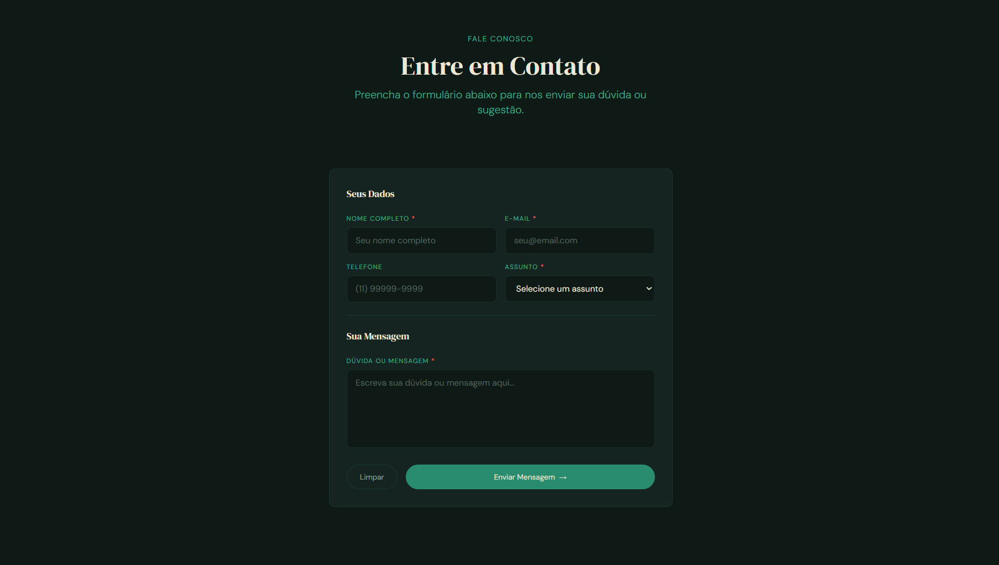
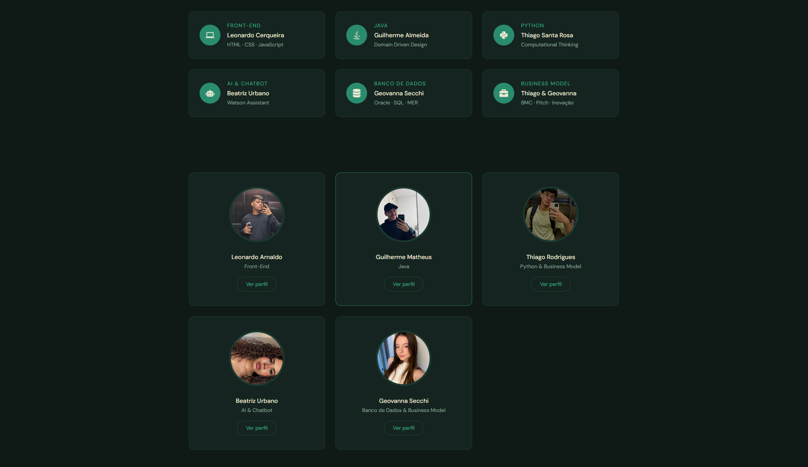

# 🌱 Rotta

## Sobre o projeto

O **Rotta** é uma solução desenvolvida com o objetivo de incentivar práticas sustentáveis no dia a dia, conectando ações positivas para o meio ambiente a benefícios relacionados à mobilidade urbana.

A proposta integra sustentabilidade e transporte público de forma simples e acessível. O usuário pode registrar ações sustentáveis, acumular pontos e posteriormente convertê-los em créditos para utilização no transporte público.

O projeto foi desenvolvido como parte do **Challenge FIAP**, em parceria com a **SoulUp**, utilizando tecnologias modernas de desenvolvimento Front-End.

---

## 🎯 Objetivo

O objetivo do Rotta é estimular hábitos sustentáveis por meio de um sistema de recompensas.

Entre as ações consideradas estão:

* ♻️ Separação de materiais recicláveis;
* 💧 Uso de garrafas reutilizáveis;
* 🚶 Deslocamento a pé ou de bicicleta;
* 🛍️ Uso de sacolas reutilizáveis;
* 💡 Economia de energia;
* 🗑️ Descarte correto de resíduos.

As ações realizadas geram pontos que podem ser utilizados para obter créditos destinados ao transporte público.

---

## 🚀 Tecnologias utilizadas

O projeto foi desenvolvido utilizando:

* **React** — desenvolvimento da interface e componentização;
* **Vite** — ferramenta de build e desenvolvimento;
* **TypeScript** — tipagem e maior segurança no código;
* **Tailwind CSS** — estilização e responsividade;
* **React Router DOM** — navegação entre as páginas e implementação da SPA;
* **React Hook Form** — gerenciamento e validação de formulários;
* **React Icons** — utilização de ícones na interface;
* **Git e GitHub** — versionamento e colaboração da equipe.

---

## 📁 Estrutura de pastas

```text
rotta/
│
├── .gitignore
├── README.md
├── eslint.config.js
├── index.html
├── package.json
├── package-lock.json
├── tailwind.config.js
├── tsconfig.json
├── tsconfig.app.json
├── tsconfig.node.json
├── vite.config.ts
│
├── public/
│   ├── images/
│   │   ├── img01-login.jpeg
│   │   ├── img02-logo.jpeg
│   │   ├── img03-mascote.png
│   │   ├── img04-rotta-card.png
│   │   ├── img05-leonardo.jpeg
│   │   ├── img06-guilherme.jpeg
│   │   ├── img07-thiago.jpeg
│   │   ├── img08-beatriz.jpeg
│   │   ├── img09-geovanna.jpeg
│   │   ├── img10-ecobag.png
│   │   ├── img11-login.png
│   │   ├── img12-home.png
│   │   ├── img13-sobre.png
│   │   ├── img14-solucao.png
│   │   ├── img15-carteira.png
│   │   ├── img16-faq.png
│   │   ├── img17-contato.png
│   │   └── img18-integrantes.png
│   │
│   └── videos/
│       └── vid01-capi.mp4
│
└── src/
    │
    ├── App.tsx
    ├── index.css
    └── main.tsx
    │
    ├── components/
    │   │
    │   ├── CardIntegrante/
    │   │   └── index.tsx
    │   │
    │   ├── Footer/
    │   │   └── index.tsx
    │   │
    │   ├── Header/
    │   │   └── index.tsx
    │   │
    │   ├── MascoteCapivara.tsx/
    │   │   └── index.tsx
    │   │
    │   └── ValidacaoFoto/
    │       └── index.tsx
    │
    ├── layouts/
    │   └── Layout.tsx
    │
    └── routes/
        │
        ├── Carteira/
        │   └── index.tsx
        │
        ├── Contato/
        │   └── index.tsx
        │
        ├── Faq/
        │   └── index.tsx
        │
        ├── Home/
        │   └── index.tsx
        │
        ├── Integrantes/
        │   └── index.tsx
        │
        ├── Sobre/
        │   └── index.tsx
        │
        ├── Solucao/
        │   └── index.tsx
        │
        └── login/
            └── index.tsx
```

---

## 🖥️ Páginas do projeto

### Home

Apresenta o projeto, sua proposta e os principais recursos da solução.

### Integrantes

Apresenta os integrantes da equipe e permite acessar informações individuais por meio de rotas dinâmicas.

### Sobre

Apresenta informações sobre o projeto, sua proposta e seus objetivos.

### FAQ

Página de perguntas frequentes sobre a solução, com sistema de busca e perguntas organizadas em categorias.

### Contato

Página destinada ao contato com a equipe, contendo formulário para envio de informações.

### Solução

Apresenta a solução proposta pelo projeto e seus principais recursos.

### Carteira

Permite visualizar os pontos acumulados, registrar ações sustentáveis, consultar o histórico e simular a conversão de pontos em créditos de transporte.

---

## 🧩 Componentização

A aplicação utiliza uma arquitetura baseada em componentes reutilizáveis.

Entre os principais componentes estão:

* **Header** — cabeçalho e navegação principal;
* **Footer** — rodapé da aplicação;
* **CardIntegrante** — componente reutilizável para apresentação dos integrantes;
* **Layout** — estrutura compartilhada entre as páginas.

A utilização de componentes permite reduzir a repetição de código e facilita a manutenção e evolução da aplicação.

---

## 🧭 Navegação

O projeto utiliza **React Router DOM** para implementar a navegação como uma **Single Page Application (SPA)**.

Entre as rotas utilizadas estão:

```text
/home
/integrantes
/integrantes/:id
/sobre
/faq
/contato
/solucao
/carteira
```

A rota:

```text
/integrantes/:id
```

utiliza parâmetros dinâmicos para apresentar informações específicas de cada integrante.

---

## 📱 Responsividade

A interface foi desenvolvida utilizando **Tailwind CSS**, buscando garantir uma boa experiência em diferentes tamanhos de tela.

O projeto considera:

* 📱 Mobile;
* 📲 Tablet;
* 🖥️ Desktop.

A aplicação utiliza classes responsivas do Tailwind CSS para adaptar grids, menus, espaçamentos, textos e componentes de acordo com o tamanho da tela.

---

## 📝 Formulários

Os formulários da aplicação utilizam **React Hook Form** para gerenciamento dos dados e validação das informações inseridas pelo usuário.

As validações incluem campos obrigatórios e mensagens de erro para orientar o usuário durante o preenchimento.

---

## ⚙️ Como executar o projeto

### Pré-requisitos

Antes de executar o projeto, é necessário ter instalado:

* [Node.js](https://nodejs.org/)
* npm

### Instalação

Clone o repositório:

```bash
git clone https://github.com/ROTTA-SoulUP/rotta-frontend
```

Entre na pasta do projeto:

```bash
cd NOME_DA_PASTA
```

Instale as dependências:

```bash
npm install
```

Execute o projeto em ambiente de desenvolvimento:

```bash
npm run dev
```

Após executar o comando, acesse no navegador o endereço informado pelo Vite, normalmente:

```text
http://localhost:5173
```

### Build de produção

Para gerar a versão de produção:

```bash
npm run build
```

---

## 🔗 Repositório GitHub

**Repositório oficial:**

https://github.com/ROTTA-SoulUP/rotta-frontend

---

## 🎥 Vídeo do projeto

**Apresentação do projeto no YouTube:**

[https://www.youtube.com/watch?v=Ja8B9hhbAPE]

---

# 👥 Integrantes

## Leonardo

**RM:** 573188

**Turma:** 1TDSPJ

**LinkedIn:** https://www.linkedin.com/in/leonardo-cerqueira-12a400400/

**GitHub:** https://github.com/LeonardoSilva1203



---

## Beatriz

**RM:** 569341

**Turma:** 1TDSPJ

**LinkedIn:** https://www.linkedin.com/in/beatriz-urbano-5a9bab254

**GitHub:** https://github.com/BeaUrbano


---

## Geovanna

**RM:** 573452

**Turma:** 1TDSPJ

**LinkedIn:** https://www.linkedin.com/in/geovanna-secchi-egea-3194553b5

**GitHub:** https://github.com/geovannasecchi


---

## Guilherme

**RM:** 571713

**Turma:** 1TDSPJ

**LinkedIn:** http://www.linkedin.com/in/guimmalmeida

**GitHub:** https://github.com/GuilhermeAlmeida0207"


---

## Thiago

**RM:** 572616

**Turma:** 1TDSPJ

**LinkedIn:** https://www.linkedin.com/in/thiago-rodrigues-santa-rosa-39b3b3305/

**GitHub:** https://github.com/Thiagordsr


---

# 📸 Imagens do projeto

Adicione nesta seção capturas de tela das principais páginas da aplicação.


### Login



### Home



### Solução



### FAQ



### Carteira



### Contato



### Integrantes



---

# 📞 Contato

Para informações sobre o projeto, entre em contato com a equipe:

**GitHub:** https://github.com/ROTTA-SoulUP/rotta-frontend

**YouTube:** [https://www.youtube.com/watch?v=Ja8B9hhbAPE]

---
